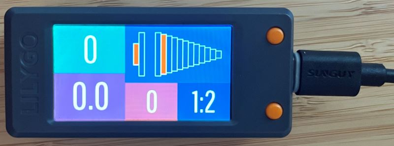

# External Display for WAHOO KICKR BIKE SHIFT
Code is written for LILYGO T-Display-S3 ESP32-S3 or LILYGO TTGO T-Display ESP32 and displays the following Bluetooth Low Energy (BLE) data:

- Gearing ratio (as set in the wahoo app) and what gears you are currently in. Information (text and graphic) will update when shifting.
- Cyclist weight (as set in the wahoo app)
- Cycling power (Watt or watts per kilogram). Displayed information can be changed via a button (BOOT) on the device.
- Cycling cadence (RPM - revolutions per minute)

## Setup
You need to install the Arduino IDE to compile and upload the code to the microcontroller. A very good HOWTO can be found here:
https://github.com/teastainGit/LilyGO-T-display-S3-setup-and-examples/blob/main/T-DisplayS3_Setup.txt

## TFT_eSPI
Comment and un-comment the following lines in the "..\libraries\TFT_eSPI\User_Setup_Select.h" file depending on which board you use.

> #include <User_Setups/Setup25_TTGO_T_Display.h>
>
> #include <User_Setups/Setup206_LilyGo_T_Display_S3.h>

## A few things to consider

1. If you have changed the Bluetooth name of your bike (in the wahoo app) you will need to change it also in the code:

> // BLE Server name
> 
> #define bleServerName "KICKR BIKE SHIFT 720C"

2. Set Display Resolution "170 x 320" for LILYGO T-Display-S3 ESP32-S3 or "135 x 240" for LILYGO TTGO T-Display ESP32
   
> #define RESOLUTION_X 320
> 
> #define RESOLUTION_Y 170

3. The graphic should scale depending on the gearing setting, so it will fit the screen. (There are variables to change the rendering if necessary.)

> int myGearWidth = (IWIDTH - 35) / (myFrontGears + myRearGears);
> 
> #define myGearHeight (RESOLUTION_Y - 60)
> 
> #define myGearSpacing -1
> 
> #define myGearX 15
> 
> #define myGearY 30

## Development Notes

1. Debugging: All Status messages during initiation and during connecting process will be displayed on the TFT and in the serial monitor window of the IDE. I tried to comment the code so that it is easier to understand.

2. To identify BLE GATT servies and characteristics use https://www.bluetooth.com/specifications/assigned-numbers/ and if you look at GATT Specification Supplement 5 it describes how to intepret the bytes: https://www.bluetooth.com/specifications/specs/gatt-specification-supplement-5/
   
3. Scan BLE devices: https://www.nordicsemi.com/Products/Development-tools/nrf-connect-for-mobile

Enter the upload mode for Sketch upload manually.
- Connect the board via the USB cable
- Press and hold the BOOT button (next to RST) , While still pressing the BOOT button, press RST
- Release the RST
- Release the BOOT button
- Upload sketch

### Cycling Power Measurement (Power & Cadence)
As mentioned in the GATT Specification Supplement document the Service 0x1818 holds the characteristic 0x2A63. The first UINT16 (unsigned 16-bits integer) holds the FLAGS. In our Case "3C00" (as little-endian) and so we get "00000000 00111100". Section "3.59.2.1 Flags field" in the document tells us which values are beeing submitted:

- Pedal Power Balance Present: False
- Pedal Power Balance Reference: Unknown
- __Accumulated Torque Present: True 16__
- __Accumulated Torque Source: Crank based__
- __Wheel Revolution Data Present: True 32 & 16__
- __Crank Revolution Data Present: True 16 & 16__
- treme Force Magnitudes Present: False
- Extreme Torque Magnitudes Present: False
- Extreme Angles Present: False
- Top Dead Spot Angle Present: False
- Bottom Dead Spot Angle Present: False
- Accumulated Energy Present: False
- Offset Compensation Indicator : False

So the values in the characteristic are:

| Flags field | Instantaneous Power | Accumulated Torque | Cumulative Wheel Revolutions | Last Wheel Event Time | Cumulative Crank Revolutions | Last Crank | Event Time | 
| --- | --- | --- | --- | --- | --- | --- | --- | 
| Mandatory | Mandatory | Optional | Optional | Optional | Optional | Optional | Optional | 
| 0 - uint16 | 1 | 2 | 3 | 4 | 5 | 6 | 7 | 
| [0][1] | [2][3] | [4][5] | [6][7] | [8][9] | [10][11] | [12][13] | [14][15] | 

